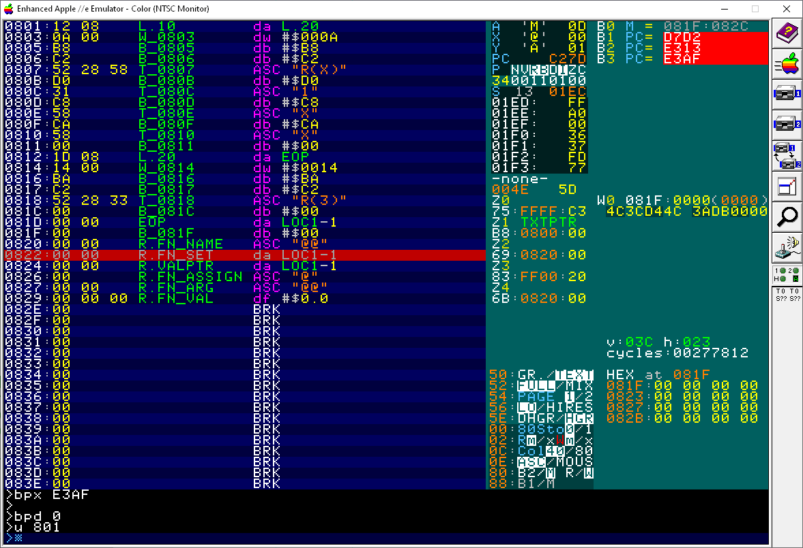
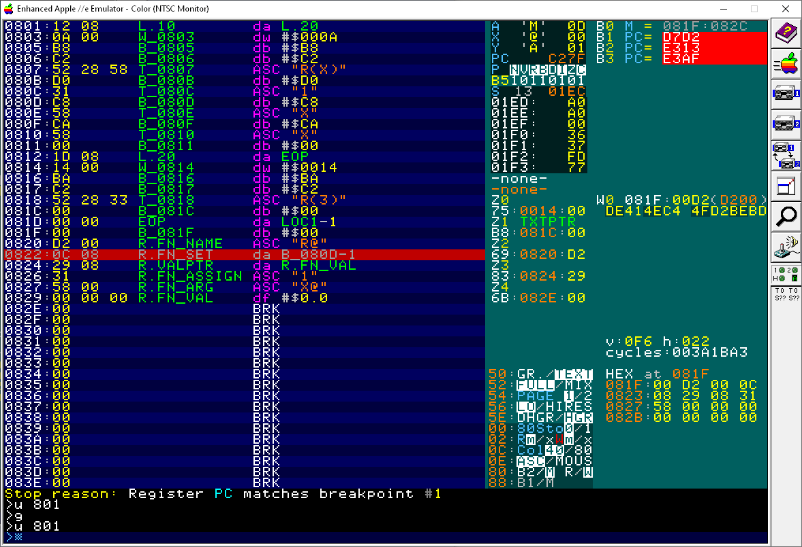
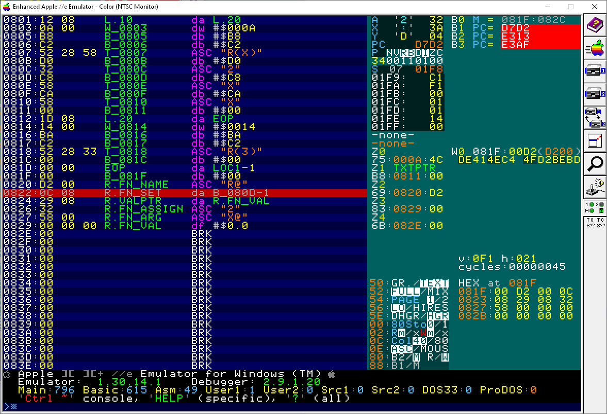

# Exploring BASIC's DEF FN

Context: In this 8-Bit Show and Tell [One-Line Bouncing Ball: Commodore 64 BASIC](https://www.youtube.com/watch?v=jhQgHW2VI0o) episode Robin presented a solution using `DEF FN`.

```BASIC
0 DEF FN A(B)=ABS(T-INT(T/B)*B-B/2):POKE Z,32:Z=1024+FNA(48)*40+FNA(78):POKE Z,81:T=T+1:GOTO
```

Norbert Landsteiner and I started discussing how `DEF FN` was tokenized an implemented across a few different 8-bit BASICs, such as PET and Applesoft.

# BASIC Program

This is the BASIC program we are analyzing:

```BASIC
10 DEFFNR(X)=1+X*X
20 PRINT FNR(3)
```

# Tokens

Which looks like this memory:

```
PET BASIC           Applesoft           Meaning
--------------------------------------------------------------
0400:00             0800:00             Technical start of BASIC program, but next byte is pointed to.
0401:12 04          0801:12 08 __ __    Pointer to next line
0403:0A 00          0803:0A 00 __ __    Line #10
0405:96             0805:B8 __ __ __    Token DEF
0406:A5             0806:C2 __ __ __    Ttoken FN
0407:52 28 58 29    0807:52 28 58 29    ASCII "R(X)"
040B:B2             080B:D0 __ __ __    Token =
040C:31             080C:31 __ __ __    ASCII "1"
040D:AA             080D:C8 __ __ __    Token +
040E:58             080E:58 __ __ __    ASCII "X"
040F:AC             080F:CA __ __ __    Token *
0410:58             0810:58 __ __ __    ASCII "X"
0411:00             0811:00 __ __ __    -EOL-

0412:1E 04          0812:1D 08 __ __    Pointer to next line
0414:14 00          0814:14 00 __ __    Line #20
0416:99             0816:BA __ __ __    Token PRINT
0417:20                                 ASCII " "
0418:A5             0817:C2 __ __ __    Token FN
0419:52 28 33 29    0818:52 28 33 29    ASCII "R(3)"
041D:00             081C:00 __ __ __    -EOL-

041E  00 00         081D:00 00 __ __    -EOP-
```

* 

# BASIC Differences

From examing the tokens we see a few notable differences:

* The BASIC keyword tokens are not only different but also have a different ordering!

```
    Dialect  PET  Applesoft
    -----------------------
    DEF      $96  $B8
    FN       $A5  $C2
    -----------------------
    Delta    +$F  +$A
```

* Applesoft removes _all spaces_ between tokens where as PET _preserves_ spaces.

# Variables

To markup and trace the variables in AppleWin use these debugger commands:

```
db  SOP 800
da  L.10 801
dw  803
db  805
db  806
asc 807:80A
db  80B
asc 80C
db  80D
asc 80E
db  80F
asc 810
db  811

da  L.20 812
dw  814
db  816
db  817
asc 818:81B
db  81c

da  EOP 81d
db  81f

asc R.FN_NAME   820:821   // FN Name, high bit set
da  R.FN_SET    822       // FN Pointer to token after "FN R(X) =" assignment, $80C
da  R.VALPTR    824       // FN Pointer to current FN (float) value, $0829
asc R.FN_ASSIGN 826       // FN Copy of token after assignment, "1"
asc R.FN_ARG    827:828   // FN Argument variable name, "X"
df  R.FN_VAL    829:829+4 // FN Floating point value; VARPNT also points here

w 81F
md1 81F

da  TXTTAB    67        // Start of BASIC program $801
da  VARTAB    69
da  ARYTAB    6B
da  STREND    6D
da  FRETOP    6F
dw  FRESPC    71
da  MEMSIZE   73
da  CURLINE   75        // Current Line Number
da  OLDLINE   77
da  OLDTXTPTR 79
da  DATALINE  7B
da  DATAPTR   7D
da  INPTR     7F
asc VARNAME   81:82
da  VARPNT    83
da  FORPNT    85
da  FUNCNAME  8A        // TEMP3, but also Pointer to FN_SET, $0822
df  FAC       9D:9D+4   // Floating-point Accumulator
db  FAC.SIGN  A2
da  PRGEND    AF
da  TXTPTR    B8        // Next token to execute
df  RNDSEED   C9
sym GET.FN.NAME = E341

zpc *
zpa CURLIN
zpa TXTPTR
zpa VARTAB
zpa VARPNT
zpa ARYTAB

bpm 81F:82C
bpx D7D2
bpx E313
bpx E3AF

bpd 0
```

Variables at run-time:

After `DEF` Line #10

```
PET BASIC           Applesoft           Meaning
0420:D2 00          0820:D2 00          FN variable name with high bit set on first char; Variable "R"
0422:0C 04          0822:0C 08          [0,1]: Pointer to token after "FN R(X) =" assignment
0424:29 04          0824:29 08          [2,3]: Pointer to current FN (float) value
0426:31             0826:31             [4  ]: Copy of token after assignment, "1"
0427:58 00          0827:58 00          FN Argument variable name, "X"
0429:00 00 00 00 00 0829:00 00 00 00 00 FN Floating point value, 0.0 (1-Byte Exponent, 4-byte Mantissa)
042C:               082C:               next variable
```

* 


After `FN` Line #20  ($DAE8)

* 


```
PET BASIC           Applesoft          Meaning
```

Tracing `DEF`:

```asm
E32E:48         PHA                 ; [4] SAVE CHAR AFTER "=" --> '1' $31
E32F:A5 84      LDA VARPNT+1        ; [3] /$0829 -> $08
E331:48         PHA                 ;
E332:A5 83      LDA VARPNT          ; [2] #$0829 -> $29
E334:48         PHA                 ;
E335:A5 B9      LDA TXTPTR+1        ; [1] /$080C -> $08
E337:48         PHA                 ;
E338:A5 B8      LDA TXTPTR          ; [0] #$080C -> $0C
E33A:48         PHA                 ;
E33B:20 95 D9   JSR DATA            ; SCAN TO NEXT STATEMENT
E33E:4C AF E3   JMP FN_DATA         ; STORE ABOVE 5 BYTES IN "VALUE"

            FN_DATA
E3AF:A0 00      LDY #0
E3B1:68         PLA                 ; [0]0822: #$080C
E3B2:91 8A      STA (FUNCNAME),Y
E3B4:68         PLA                 ; [1]0823: /$080C
E3B5:C8         INY
E3B6:91 8A      STA (FUNCNAME),Y
E3B8:68         PLA                 ; [2]0824: #0829
E3B9:C8         INY
E3BA:91 8A      STA (FUNCNAME),Y
E3BC:68         PLA                 ; [3]0825: /$0829
E3BD:C8         INY
E3BE:91 8A      STA (FUNCNAME),Y
E3C0:68         PLA                 ; [4]0826: '1'
E3C1:C8         INY
E3C2:91 8A      STA (FUNCNAME),Y
E3C4:60         RTS
```

Tracing `FN`:

```
E363:68         PLA                 ; GET FUNCTION ADDRESS BACK
E364:85 8A      STA FUNCNAME        ; #$0822
E366:68         PLA                 ; /$0822
E367:85 8B      STA FUNCNAME+1
E369:A0 02      LDY #2              ; POINT AT ADD OF ARGUMENT VARIABLE
E36B:B1 8A      LDA (FUNCNAME),Y    ; ')'
E36D:85 83      STA VARPNT
E36F:AA         TAX
E370:C8         INY
E371:B1 8A      LDA (FUNCNAME),Y    ; /$0822
E373:F0 99      BEQ UNDFNC          ; UNDEFINED FUNCTION
E375:85 84      STA VARPNT+1        ; A=08
E377:C8         INY                 ; val[4] $082D:00  Y=4 NOW
E378:B1 83  .1  LDA (VARPNT),Y      ; val[3] $082C:00  SAVE OLD VALUE OF ARGUMENT VARIABLE
E37A:48         PHA                 ; val[2] $082B:00  ON STACK, IN CASE ALSO USED AS
E37B:88         DEY                 ; val[1] $082A:00  A NORMAL VARIABLE!
E37C:10 FA      BPL .1              ; val[0] $0829:00
E37E:A4 84      LDY VARPNT+1        ; Y=$0829          (Y,X)= ADDRESS, STORE FAC IN VARIABLE
E380:20 2B EB   JSR STORE.FAC.AT.YX.ROUNDED  ; $9D..A1: 3.0 -> $0829..$082D
E383:A5 B9      LDA TXTPTR+1        ; A=#$081C         REMEMBER TXTPTR AFTER FN CALL
E385:48         PHA
E386:A5 B8      LDA TXTPTR          ; A=/$081C
E388:48         PHA
E389:B1 8A      LDA (FUNCNAME),Y    ; A=[$0822] #$080C  Y=0 FROM MOVMF
E38B:85 B8      STA TXTPTR          ; B8:0C             POINT TO FUNCTION DEF'N
E38D:C8         INY                 ;
E38E:B1 8A      LDA (FUNCNAME),Y    ;
E390:85 B9      STA TXTPTR+1
E392:A5 84      LDA VARPNT+1        ; SAVE ADDRESS OF ARGUMENT VARIABLE
E394:48         PHA
E395:A5 83      LDA VARPNT
E397:48         PHA
E398:20 67 DD   JSR FRMNUM          ; FAC = -10.0 EVALUATE THE FUNCTION EXPRESSION
E39B:68         PLA                 ; A=$29       GET ADDRESS OF ARGUMENT VARIABLE
E39C:85 8A      STA FUNCNAME        ;        AND SAVE IT
E39E:68         PLA                 ; A=$08
E39F:85 8B      STA FUNCNAME+1
E3A1:20 B7 00   JSR CHRGOT          ; MUST BE AT ":" OR EOL
E3A4:F0 03      BEQ .2              ; WE ARE
E3A6:4C C9 DE   JMP SYNERR          ; WE ARE NOT, SYNTAX ERROR
E3A9:68      .2 PLA                 ; A=$1C RETRIEVE TXTPTR AFTER "FN" CALL
E3AA:85 B8      STA TXTPTR          ; 
E3AC:68         PLA                 ; A=$08
E3AD:85 B9      STA TXTPTR+1        ; FAC = -10.0
            FN_DATA
E3AF:A0 00      LDY #0
E3B1:68         PLA                 
E3B2:91 8A      STA (FUNCNAME),Y    ; [0]0829: #00
E3B4:68         PLA                 
E3B5:C8         INY
E3B6:91 8A      STA (FUNCNAME),Y    ; [1]082A: #00
E3B8:68         PLA                 
E3B9:C8         INY
E3BA:91 8A      STA (FUNCNAME),Y    ; [2]082A: #00
E3BC:68         PLA                 
E3BD:C8         INY
E3BE:91 8A      STA (FUNCNAME),Y    ; [3]082B: #00
E3C0:68         PLA                 
E3C1:C8         INY
E3C2:91 8A      STA (FUNCNAME),Y    ; [4]082C: #00
E3C4:60         RTS                 ; R.FN_VAL = 0.0

E996: JSR MULTIPLY.1
E999: LDA VPNT+1                    ; FAC now has -12
:
E82E: LDY #0                        ; FAC now has -9
```

# Code

BASIC Interpreter Zero-Page Locations:
```
Datation        PET BASIC   Applesoft   Notes
TXTTAB          $??,$$      $67,$68     Start of Program, $0801
VARTAB          $??,$$      $69,$6A     Start of Variables
ARYTAB          $??,??      $6B,$6C     
CURLINE         $??,??      $75,$76     
VARPNT          $??,??      $83,$84     Points to current variable
```

BASIC Implementation:
```
Function        PET BASIC   Applesoft   Notes
DEF             $????       $E313       Implements DEF
FN              $????       $E354       Implements FN
NEW.VAR.ARY     $????       $E09C       Make new variable array
SETPTRS         $????       $D665       Initialize BASIC pointers
NEWSTT          $????       $D7D2       Execute next statement
EXECUTE         $????       $D828
```

# Inspecting FN 5 bytes


If we modify the BASIC program to have a `2` constant instead:

```BASIC
10 DEFFNR(X)=2+X*X
20 PRINT FNR(3)
```

This is memory before `RUN`:

* 

This is memory after executing the `DEF:

* 

This is memory after executing the `FN`:

* 

# References

* http://www.txbobsc.com/scsc/scdocumentor/
* https://6502disassembly.com/a2-rom/Applesoft.html
